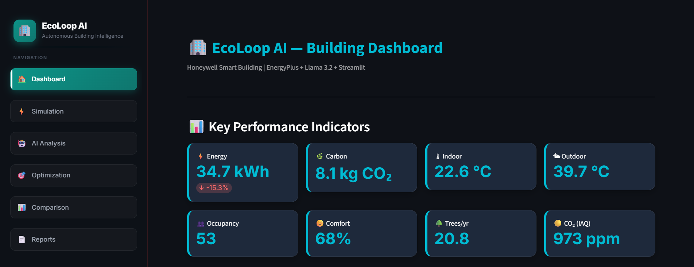
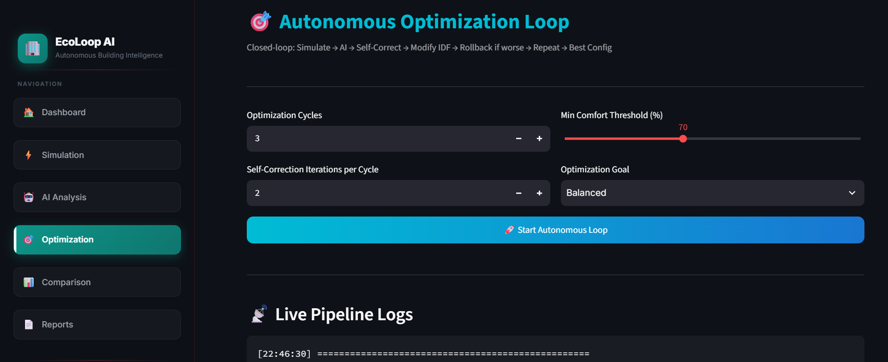
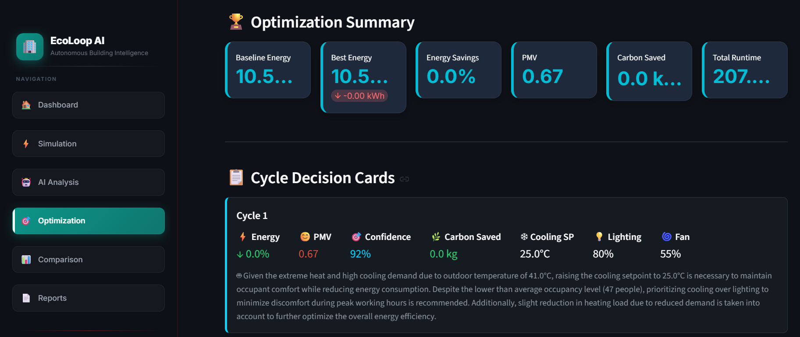
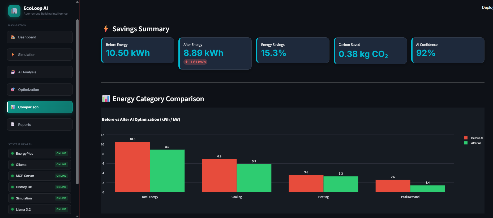
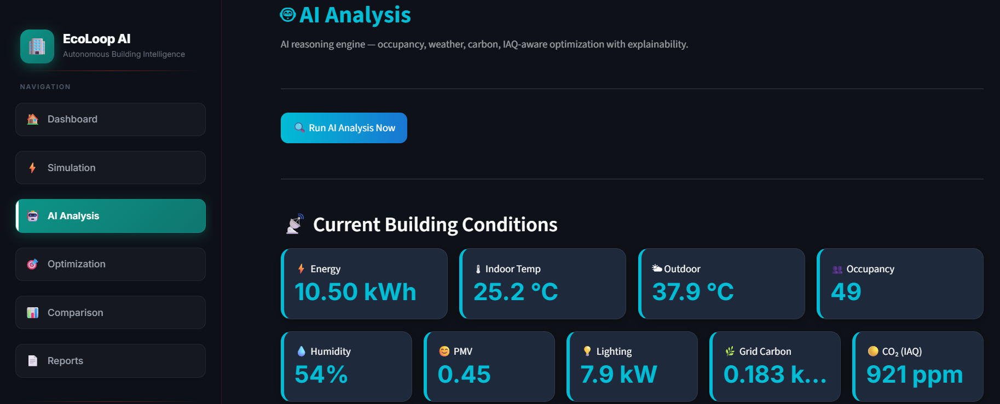
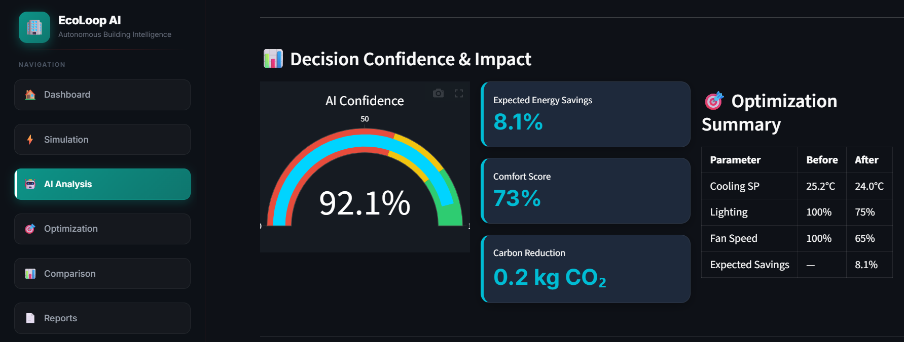

# 🏢 EcoLoop AI


 


> **Autonomous closed-loop building energy optimization** — EnergyPlus simulation + Llama 3.2 AI agent + real-time Streamlit dashboard.
>
> Built for **Honeywell Technologies Hackathon** — Problem Statement 1: Eco-Loop Building Agents.

---

## Why EcoLoop AI?

Traditional Building Management Systems rely on static schedules and manual tuning.

EcoLoop AI introduces an autonomous closed-loop optimization pipeline that continuously analyzes building performance, reasons over real-time conditions, and updates HVAC control strategies without human intervention.


## ✨ Features

- ✅ Closed-loop autonomous optimization — no manual intervention
- ✅ EnergyPlus v26.1 physics-based building simulation
- ✅ Llama 3.2 AI agent — occupancy, weather, and carbon-aware
- ✅ Self-correction loop (ASHRAE 55 comfort-aware optimization) — iterates until PMV and confidence converge
- ✅ Automatic IDF rollback when energy regresses
- ✅ Versioned IDF files saved per optimization cycle
- ✅ 12 MCP tools via FastMCP for AI agent integration
- ✅ Streamlit dashboard with live KPIs and charts
- ✅ Downloadable reports — PDF, CSV, Excel, JSON
- ✅ 100% open-source — no cloud, no proprietary BMS hardware

---

## 🎬 Demo Video

[▶ Watch POC Demo Video](POC%20Demo%20Video.MP4) (Click on View Raw)

---

## 📸 Screenshots

### 🏠 Dashboard


### 🎯 Optimization Loop



### 📊 Energy Comparison


### 🤖 AI Analysis



---

## 🏗 How It Works


```
EnergyPlus Simulation
        │
        ▼
Extract Metrics (energy, PMV, occupancy, carbon intensity)
        │
        ▼
Llama 3.2 AI Agent — Self-Correction Loop
  → Generate decision → Score → Iterate until converged
        │
        ▼
Modify building.idf(5ZoneAirCooled.idf) via eppy → Save versioned copy
        │
        ▼
Energy worse than best? → Rollback IDF
        │
        ▼
Save to history.csv → Repeat N cycles
```

> See [docs/architecture.md](docs/architecture.md) for the full technical reference including the self-correction algorithm, AI memory, awareness rules, and MCP tool details.

---

## 🛠 Technology Stack

| Layer | Technology |
|---|---|
| Building Simulation | EnergyPlus v26.1 |
| AI Agent | Llama 3.2 via Ollama (ollama Python library) |
| IDF Editor | eppy |
| Dashboard | Streamlit |
| Charts | Plotly |
| MCP Server | FastMCP |
| Reports | reportlab, openpyxl |
| Language | Python 3.11+ |

---

## 📁 Project Structure

```
EcoLoop/
├── app.py                  # Streamlit entry point + premium sidebar
├── backend.py              # Data-access layer
├── simulation.py           # EnergyPlus interface
├── optimizer.py            # Llama 3.2 AI engine
├── idf_modifier.py         # IDF editor + rollback
├── mcp_server.py           # FastMCP — 12 tools + 1 prompt
├── history.py              # CSV persistence
├── decision.py             # OptimizationDecision dataclass
├── models.py               # BuildingState dataclass
├── prompts.py              # AI system prompt
├── report_generator.py     # PDF report builder
├── config.py               # EnergyPlus path config
├── utils.py                # Shared utilities
├── style.css               # Dashboard dark theme
├── page_modules/           # 6 Streamlit page modules
├── energyplus/             # building.idf + weather.epw
├── outputs/                # energy.csv, history.csv, idf_versions/
├── assets/                 # Screenshots
└── docs/                   # architecture.md
```

---

## 🚀 Installation & Running

### Prerequisites

- Python 3.11+
- [EnergyPlus v26.1](https://energyplus.net) at `C:\EnergyPlusV26-1-0`
- [Ollama](https://ollama.com) installed and running

### Setup

```bash
# 1. Install dependencies
pip install -r requirements.txt

# 2. Start Ollama and pull the model (separate terminal)
ollama serve
ollama pull llama3.2

# 3. Run the dashboard
streamlit run app.py

# 4. (Optional) Run the MCP server
python mcp_server.py
```

Opens at **http://localhost:8501**

---

## 📊 Dashboard Pages

| Page | Description |
|---|---|
| 🏠 Dashboard | KPIs (2×4 grid), live energy gauge, AI decision card, context panels, history charts |
| ⚡ Simulation | Run EnergyPlus, progress bar, energy/demand/cooling/heating KPIs, charts |
| 🤖 AI Analysis | Inefficiency detection, reasoning chain, confidence gauge, decision log |
| 🎯 Optimization | Autonomous loop, self-correction, rollback, decision cards, timing charts |
| 📊 Comparison | Before/after energy, carbon, PMV/PPD comfort, savings breakdown |
| 📄 Reports | Download PDF / CSV / Excel / JSON |

---


## 🔌 MCP Tools (12)

`run_optimization` · `get_building_metrics` · `get_optimization_history` · `get_energy_comparison` · `get_comfort_metrics` · `get_carbon_metrics` · `get_system_status` · `apply_optimization` · `run_energyplus` · `read_simulation_results` · `modify_building_model` · `validate_simulation`

Plus 1 prompt: `system_prompt()`

> Full tool descriptions in [docs/architecture.md](docs/architecture.md)

---

## 🔮 Future Work

- Reinforcement learning agent replacing rule-based self-correction
- Real IoT sensor integration (BACnet / Modbus)
- Native Honeywell Forge / OpenBlue BMS connector
- Multi-zone and multi-building optimization
- Cloud deployment with real-time monitoring dashboard

---

## 👥 Team

**Sai Nimbalkar**

Built for the **Honeywell Technologies Hackathon**
Problem Statement 1 — Eco-Loop Building Agents.

---

## 📜 License

MIT License — open source, free to use and modify.
